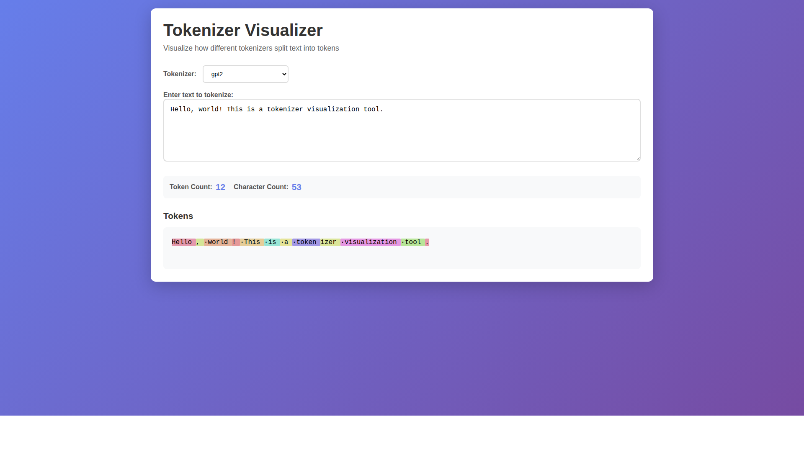
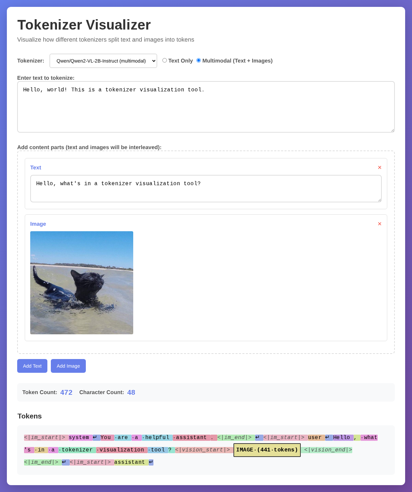

# Tokenizer Visualizer

A tool to visualize how different tokenizers split text and images into tokens. Each token is displayed with a unique color based on its token ID.


*Text-only tokenization with GPT-2*


*Multimodal tokenization with Qwen2-VL (text + image)*

## Features

### Text Tokenization
- Multiple tokenizer support (GPT-2, Mistral, Gemma, Qwen, Phi-2, BERT, OPT)
- Real-time tokenization with debouncing
- Color-coded token visualization
- Token count and character count statistics
- Hover over tokens to see their token IDs
- Special character visualization (spaces as ·, newlines as ↵, tabs as →)

### Multimodal Tokenization (NEW!)
- **Qwen2-VL support** for text + image tokenization
- Interleaved content support - add multiple text and image blocks
- Image upload with drag-and-drop
- Visual representation of image tokens - grouped as "IMAGE (N tokens)"
- See exactly how vision-language models tokenize multimodal inputs
- Special token highlighting for model control tokens

## Setup

### Backend

1. Navigate to the backend directory:
```bash
cd backend
```

2. Install dependencies using uv:
```bash
uv sync
```

3. Run the backend server:
```bash
uv run python main.py
```

The backend will start on `http://localhost:8000`

### Frontend

1. Open `index.html` in your web browser, or serve it with a simple HTTP server:
```bash
python -m http.server 8080
```

Then visit `http://localhost:8080`

## Usage

### Text-Only Mode
1. Start the backend server
2. Open the frontend in your browser
3. Select a text tokenizer from the dropdown menu (e.g., GPT-2, Gemma, etc.)
4. Enter text in the textarea
5. View the tokenized output with color-coded tokens
6. Hover over tokens to see their token IDs

### Multimodal Mode
1. Select a multimodal tokenizer (Qwen/Qwen2-VL-2B-Instruct)
2. Switch to "Multimodal (Text + Images)" mode using the radio buttons
3. Click "Add Text" to add text blocks
4. Click "Add Image" to upload images
5. Arrange your content in any order (text, image, text, image, etc.)
6. Watch as the tokenizer processes both text and images into tokens
7. Image tokens are grouped and displayed as "IMAGE (N tokens)" where N is the number of image patch tokens

## API Endpoints

- `GET /` - Health check
- `GET /tokenizers` - List available tokenizers
  - Response: `{"tokenizers": [...], "multimodal_tokenizers": [...]}`
- `POST /tokenize` - Tokenize text or multimodal content
  - Text only: `{"text": "string", "tokenizer_name": "string"}`
  - Multimodal: `{"content": [{"type": "text", "text": "..."}, {"type": "image", "image": "base64..."}], "tokenizer_name": "string"}`
  - Response: `{"tokens": [{"token": "...", "token_id": 123, "color": "#abc", "type": "text|image|special"}], "token_count": number}`

## Available Tokenizers

### Text-Only Tokenizers
- `gpt2` - OpenAI GPT-2
- `mistralai/Mistral-7B-v0.1` - Mistral AI
- `google/gemma-2-2b` - Google Gemma
- `Qwen/Qwen2.5-7B` - Alibaba Qwen
- `microsoft/phi-2` - Microsoft Phi-2
- `bert-base-uncased` - BERT
- `facebook/opt-125m` - Meta OPT

### Multimodal Tokenizers
- `Qwen/Qwen2-VL-2B-Instruct` - Qwen2-VL vision-language model
